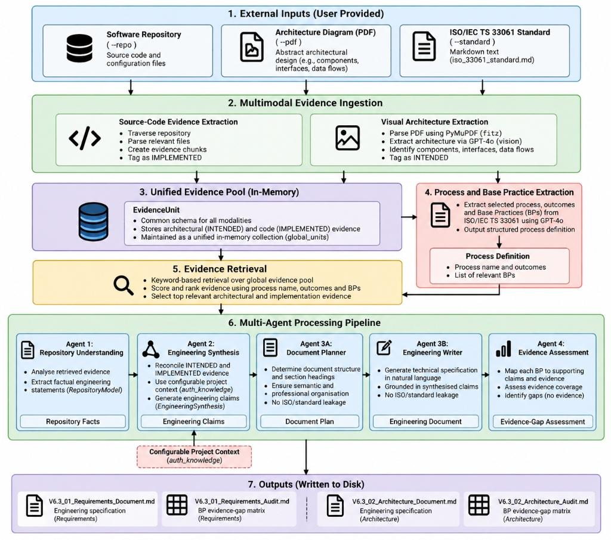
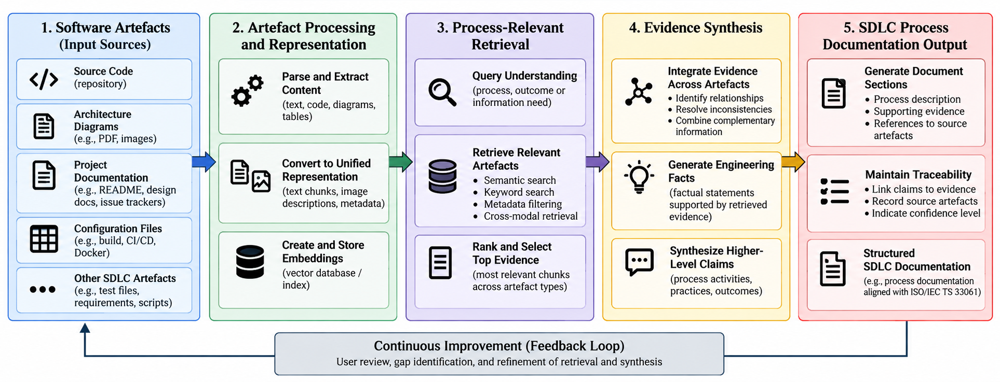

# Automating SDLC Process Documentation through Retrieval and Synthesis of Software Artefacts Using an Agentic LLM-RAG Framework

[](https://www.python.org/downloads/)
[](docs/assets/v6_3_pipeline.jpg)
[](resources/standards/)

---

## 1. Overview

Maintaining Software Development Life Cycle (SDLC) process documentation alongside evolving software artefacts is a critical challenge in regulated domains such as healthcare. Relevant engineering evidence is often distributed across heterogeneous sources, including source code repositories, architectural diagrams, configuration scripts, and process standards. 

This repository contains the **V6.3 Multimodal Agentic LLM-RAG Pipeline**, a framework designed to automate the retrieval, reconciliation, and synthesis of distributed software artefacts into ISO/IEC TS 33061-aligned lifecycle documentation. 

V6.3 is operationally independent of the earlier AutoDoc service and runs as a standalone pipeline, while retaining an OpenAI provider dependency and a configurable project-context description.

---

## 2. Research Objective

The primary objective of this research is to investigate:
> **How an agentic LLM-RAG framework can dynamically retrieve and synthesise information from heterogeneous software artefacts to support ISO/IEC TS 33061-aligned lifecycle documentation while reducing project-specific coupling.**

### Key Research Questions
* **RQ1:** How can an agentic LLM-RAG framework dynamically retrieve and synthesise information from software artefacts for SDLC process documentation?
* **RQ2:** To what extent can the framework preserve contextual depth and evidence traceability when synthesising information from multiple software artefacts?
* **RQ3:** To what extent can the framework generate contextually grounded, ISO 33061-aligned SDLC process documentation while identifying gaps in supporting evidence?

---

## 3. Case Study: OptArrow

The framework is evaluated using **OptArrow**, an open-source mathematical optimization integration engine developed within the **Recon4IMD** European research initiative (advancing computational models for inherited metabolic diseases). 

OptArrow acts as a communication bridge between client environments (MATLAB, Python) and high-performance solver backends (Python Flight Server, Julia Socket Server, HiGHS, JuMP) using Apache Arrow IPC serialization. Its heterogeneous codebase and multi-tiered runtime provide a realistic testbed for evaluating multimodal evidence synthesis across architectural design and code implementation.

---

## 4. V6.3 Agentic LLM-RAG Architecture

The V6.3 pipeline separates external project artefacts and regulatory standards from the core generative workflow. 



### Processing Workflow Stages:
1. **External Inputs:** Ingests the target software repository (`--repo`), architectural blueprint PDF (`--pdf`), and ISO standard markdown (`--standard`).
2. **Multimodal Evidence Ingestion:**
   * **Source Code:** Traverses repository files (bounded to first 1,500 characters per file for reproducibility), tagged as `IMPLEMENTED`.
   * **Visual Architecture:** Renders PDF diagrams via `PyMuPDF` and extracts components, interfaces, and data flows using `GPT-4o` (Vision), tagged as `INTENDED`.
3. **Unified Evidence Pool:** Aggregates heterogeneous units into an in-memory `EvidenceUnit` collection with explicit epistemic typing.
4. **Process & Base Practice Extraction:** Dynamically parses process names, outcomes, and Base Practices (BPs) from the supplied standard.
5. **Selective Evidence Retrieval:** Performs keyword-based retrieval over the evidence pool, prioritizing authoritative architectural models.
6. **Multi-Agent Synthesis Pipeline:**
   * **Agent 1 (Repository Understanding):** Converts retrieved evidence into structured `RepositoryFact` statements.
   * **Agent 2 (Engineering Synthesis):** Reconciles intended architecture with implemented code using domain context (`auth_knowledge`) to formulate `EngineeringClaim` statements.
   * **Agent 3A (Document Planner):** Designs document structure and semantic section headings without referencing ISO standard terminology.
   * **Agent 3B (Engineering Writer):** Authoring agent that generates technical prose detailing runtime behavior, interfaces, and data transformations without ISO leakage.
   * **Agent 4 (Evidence Assessment):** Auditing agent that evaluates synthesized claims against extracted BPs to produce a gap analysis matrix.
7. **Generated Outputs:** Writes technical specifications and gap audit reports to disk.

---

## 5. Epistemic Evidence Framework

To evaluate generated documentation against research-stage codebases without penalizing legitimate unformalized engineering intent, claims are classified across three epistemic categories:



* **Observed:** Directly supported by retrieved repository or architectural evidence (e.g., FastAPI gateway, Arrow IPC serialization, Python/Julia backends).
* **Inferred:** Plausible engineering interpretations consistent with available evidence but lacking formal documentation; requires developer validation.
* **Unsubstantiated:** Generated claims with no identifiable evidential or defensible inferential basis in project artefacts (e.g., fabricated AST traversal mechanisms or enterprise security compliance).

---

## 6. Repository Structure

```text
.
├── README.md                          # Project documentation and architectural overview
├── requirements.txt                   # Pipeline dependencies
├── pyproject.toml                     # Project configuration
├── .gitignore                         # Git ignore definitions
├── .env.example                       # Environment variable template
│
├── universal_engine/                  # Active V6.3 Implementation
│   └── pipeline_v6_3.py               # Main standalone pipeline script
│
├── resources/                         # Canonical Input Resources
│   ├── standards/
│   │   ├── README.md                  # Standards context and licensing instructions
│   │   └── iso_33061_standard.md      # Local ISO/IEC TS 33061 reference standard
│   └── case_study/
│       └── OptArrow_Architecture.pdf  # OptArrow visual architecture blueprint
│
├── docs/                              # Research Documentation & Visual Assets
│   ├── assets/
│   │   ├── v6_3_pipeline.jpg          # Pipeline architecture diagram
│   │   ├── evaluation_framework.png   # Evaluation methodology diagram
│   │   ├── retrieval_synthesis_flow.png # Conceptual synthesis flow
│   │   └── optarrow_architecture.pdf  # Case study blueprint
│   ├── methodology/
│   └── results/
│
├── outputs/                           # Evaluated Output Artifacts
│   └── representative_eval/
│       ├── V6.3_01_Requirements_Document.md # Generated Requirements Specification
│       ├── V6.3_01_Requirements_Audit.md    # Requirements Evidence-Gap Matrix
│       ├── V6.3_02_Architecture_Document.md # Generated Architecture Specification
│       └── V6.3_02_Architecture_Audit.md    # Architecture Evidence-Gap Matrix
│
└── archive/                           # Historical Provenance & Superseded Iterations
    ├── README.md                      # Provenance documentation
    ├── prototypes/                    # Early exploration scripts (AST/code block experiments)
    ├── pipeline_iterations/           # Universal Engine versions (V5.2 – V6.2)
    ├── autodoc_service/               # Legacy FastAPI web service codebase
    └── outputs_history/               # Historical generated report logs
```

---

## 7. Getting Started

### Prerequisites
* Python 3.10 or higher
* OpenAI API Key (with access to `gpt-4o`)

### Installation
1. Clone the repository:
   ```bash
   git clone https://github.com/Ayomide-ola-lab/Optarrow-.git
   cd autodoc
   ```
2. Create and activate a virtual environment:
   ```bash
   python -m venv .venv
   # Windows:
   .venv\Scripts\activate
   # Linux/macOS:
   source .venv/bin/activate
   ```
3. Install dependencies:
   ```bash
   pip install -r requirements.txt
   ```
4. Configure environment variables:
   ```bash
   cp .env.example .env
   ```
   Edit `.env` and supply your OpenAI API key:
   ```env
   OPENAI_API_KEY=sk-...
   ```

---

## 8. Executing the V6.3 Pipeline

Execute the pipeline using default canonical inputs:
```bash
python universal_engine/pipeline_v6_3.py
```

### Configurable CLI Parameters
```bash
python universal_engine/pipeline_v6_3.py \
  --repo "C:/path/to/target/repository" \
  --standard "resources/standards/iso_33061_standard.md" \
  --pdf "resources/case_study/OptArrow_Architecture.pdf" \
  --output-dir "outputs/representative_eval"
```

| Argument | Description | Default / Fallback |
| :--- | :--- | :--- |
| `--repo` | Path to target codebase repository | `../optArrow` (or `TARGET_REPO_PATH` in `.env`) |
| `--standard` | Path to ISO/IEC TS 33061 markdown standard | `resources/standards/iso_33061_standard.md` |
| `--pdf` | Path to intended architecture PDF diagram | `resources/case_study/OptArrow_Architecture.pdf` |
| `--output-dir` | Directory to save generated specs and audits | `outputs/representative_eval` |

---

## 9. Current Evaluation & Results Summary

Post-hoc evaluation of the generated specifications against the ten authoritative Base Practices (BPs) of ISO/IEC TS 33061 (TEC.3 and TEC.4) resulted in **5 Partial (1)** and **5 Unsupported (0)** ratings (0 Adequate):

| Process | Base Practice | Principal Assessment | Score (0–2) |
| :--- | :--- | :--- | :---: |
| **TEC.3: Requirements** | **BP1** | Functional boundary & stakeholder context present; preparation activities incomplete. | 1 |
| | **BP2** | Functional & implementation constraints partially represented. | 1 |
| | **BP3** | Requirements-analysis & conflict-resolution activities not established. | 0 |
| | **BP4** | Formal agreement, traceability, and baselining not established. | 0 |
| **TEC.4: Architecture** | **BP1** | Architectural drivers & context present; roadmap & criteria incomplete. | 1 |
| | **BP2** | Formal architectural viewpoints/framework selection not established. | 0 |
| | **BP3** | Components, interfaces, and data transformations represented; candidate views incomplete. | 1 |
| | **BP4** | Architecture-to-implementation relationships represented; design mapping incomplete. | 1 |
| | **BP5** | Candidate evaluation and trade-off selection not established. | 0 |
| | **BP6** | Governance, formal acceptance, traceability, and baselining not established. | 0 |

---

## 10. Key Limitations & Findings

1. **Upstream Standards-Context Retrieval Failure:** The standard extraction agent received only the first 15,000 characters of the standard. Because authoritative TEC.3/TEC.4 definitions begin beyond character 102,582, the extraction agent generated 5 plausible but non-authoritative BPs.
2. **Project-Claim Grounding Limits:** Despite accessing multimodal evidence, generation agents introduced unsubstantiated claims regarding AST traversal and enterprise security compliance, demonstrating that retrieved context does not guarantee grounded generation.
3. **Absence of Process-Level Artefacts:** Source code alone cannot evidence formal governance, baselining, or stakeholder agreement, underscoring the necessity of human-in-the-loop developer validation for research-stage software.

---

## 11. Citation & Research Provenance

This repository accompanies the conference paper:
> **Automating SDLC Process Documentation through Retrieval and Synthesis of Software Artefacts Using an Agentic LLM-RAG Framework** (Submitted to ICSE 2027 SEIP Track).

Historical scripts and early iterations are cataloged with full provenance notes in [`archive/README.md`](archive/README.md).
